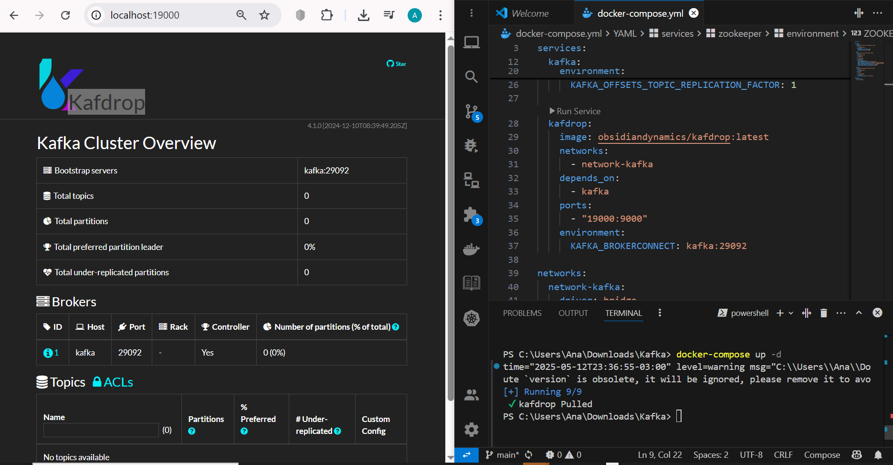
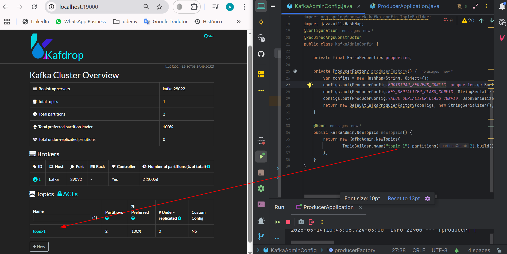

"# Kafka-Estudos" 

[](/#/)

This material is study personal.

## 1 - Run a docker-compose

````
git clone https://github.com/luizaandradeti/Kafka-Java-Spring
cd Kafka-Java-Spring
docker-compose up -d
````

_"Kafdrop is a web UI for viewing Kafka topics and browsing consumer groups. The tool displays information such as brokers, topics, partitions, consumers, and lets you view messages."(https://github.com/obsidiandynamics/kafdrop)_

- http://localhost:19000/





> [!NOTE]
>
> Contexto de engenharia de software.
>
> https://github.com/obsidiandynamics/kafdrop
> https://www.confluent.io/
> 
